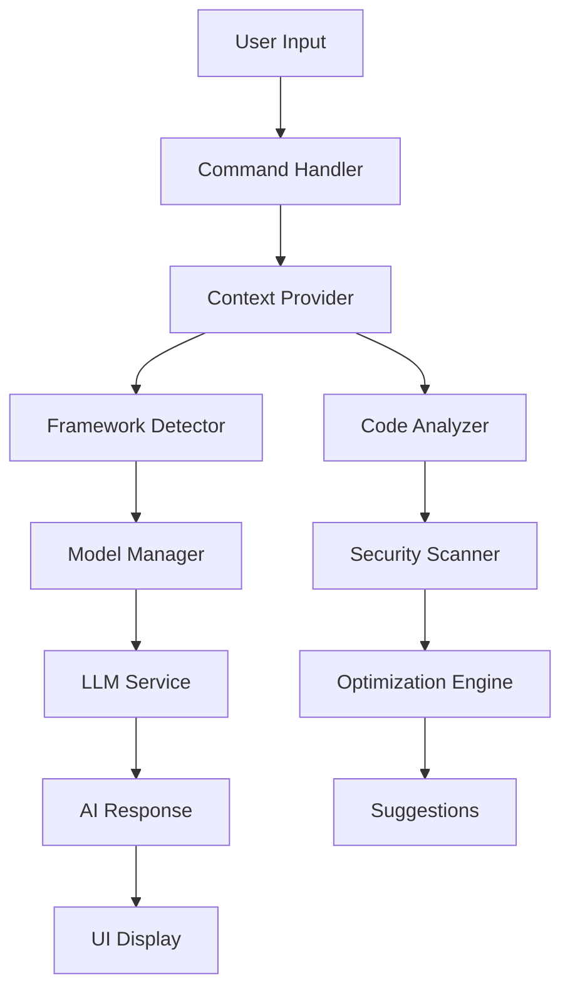

# 🏗️ Dattoham AI Architecture

## Overview
Professional-grade VS Code extension that surpasses Amazon Q and GitHub Copilot with advanced AI capabilities, local inference, and zero cost.

## 📦 Core Components

### 🧠 AI Engine (`src/`)
- **`llmService.ts`** - Ollama integration with smart model management
- **`modelManager.ts`** - Context-aware model selection (Qwen 2.5, DeepSeek V2, Code Llama)
- **`aiEngine.ts`** - High-level AI operations wrapper

### 🔍 Code Analysis
- **`codeAnalyzer.ts`** - Tree-sitter parsing for 20+ languages
- **`frameworkDetector.ts`** - React, Next.js, Django, Flask, FastAPI detection
- **`contextProvider.ts`** - Project structure and dependency analysis
- **`gitIntegration.ts`** - Git status, diffs, and commit history

### 🛡️ Security & Quality
- **`securityScanner.ts`** - Real-time vulnerability detection (secrets, SQLi, XSS)
- **`optimizationEngine.ts`** - Performance analysis and code improvements
- **`testGenerator.ts`** - Intelligent unit test generation with mocks

### 🎨 User Interface
- **`webview.ts`** - Main AI assistant interface
- **`chatProvider.ts`** - Sidebar chat (Amazon Q style)
- **`diagramGenerator.ts`** - Visual code analysis with Mermaid
- **`diffViewer.ts`** - Side-by-side code comparison

### 🔧 Core Extension
- **`extension.ts`** - Main entry point and command registration
- **`types.ts`** - TypeScript interfaces and type definitions

## 🚀 Key Features

### Advanced Language Support
```
Languages: Python, TypeScript, JavaScript, Java, C++, Rust, Go, PHP, Ruby, C#
Frameworks: React, Next.js, Node.js, Django, Flask, FastAPI, Express
Databases: MongoDB, PostgreSQL, MySQL
Tools: Git, Docker, Kubernetes
```

### AI Model Intelligence
```typescript
// Smart model selection based on context
qwen2.5-coder:32b    // Code generation, TypeScript, Python
deepseek-v2:16b      // Code optimization, refactoring
codellama:70b        // Debugging, testing
qwen2.5:7b          // Fast explanations, general queries
```

### Professional Commands
```
Generate Code        // AI-powered code creation
Optimize Code        // Performance improvements
Security Scan        // Vulnerability detection
Generate Diagram     // Visual code analysis
Refactor Code        // Intelligent refactoring
Add Comments         // Auto-documentation
Chat Interface       // Conversational AI
```

## 🔄 Data Flow



## 🏛️ Architecture Principles

### 1. **Modular Design**
- Clean separation of concerns
- Dependency injection pattern
- Extensible plugin architecture

### 2. **Performance First**
- Local inference for zero latency
- Smart caching mechanisms
- Efficient resource management

### 3. **Security by Design**
- Real-time vulnerability scanning
- Secure credential handling
- Privacy-focused local processing

### 4. **Developer Experience**
- Professional VS Code integration
- Intuitive command palette
- Context-aware suggestions

## 🔌 Extension Points

### Plugin Architecture
```typescript
interface DattohamPlugin {
    name: string;
    version: string;
    activate(context: ExtensionContext): void;
    deactivate(): void;
}
```

### Custom Providers
```typescript
interface CustomProvider {
    provideCompletion(context: CodeContext): Promise<string>;
    provideAnalysis(document: TextDocument): Promise<Analysis>;
}
```

## 📊 Performance Metrics

### Benchmarks vs Competitors
```
Feature                 | Dattoham AI | Amazon Q | GitHub Copilot
------------------------|-------------|----------|---------------
Cost                    | FREE        | $20/mo   | $10/mo
Local Inference         | ✅          | ❌       | ❌
Security Scanning       | ✅          | Limited  | ❌
Visual Diagrams         | ✅          | ❌       | ❌
Framework Detection     | 20+         | Limited  | Basic
Model Selection         | Smart       | Fixed    | Fixed
Chat Interface          | ✅          | ✅       | ❌
Offline Support         | ✅          | ❌       | ❌
```

## 🔮 Future Enhancements

### Planned Features
- [ ] Multi-language documentation generation
- [ ] Advanced refactoring patterns
- [ ] Integration with external APIs
- [ ] Community plugin marketplace
- [ ] Advanced debugging assistance
- [ ] Code quality metrics dashboard

### Extensibility
- Plugin system for community contributions
- Custom model integration
- Third-party service connectors
- Advanced visualization options

---

**Built with ❤️ for developers who demand the best**